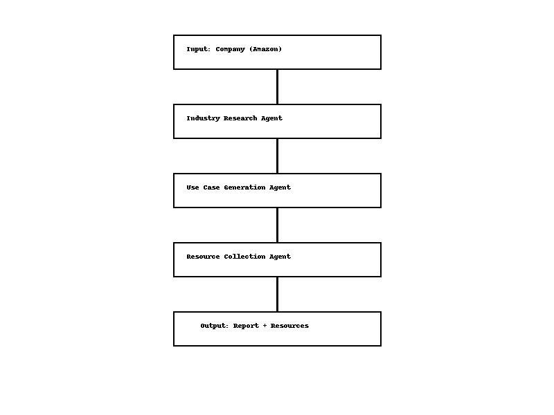

# Final Report

## Objective
Create a Multi-Agent AI System for Market Research, Use Case Generation, and Resource Collection for Amazon.

## Architecture

## Agents Description
- **Industry Research Agent**: Wikipedia-based research on Amazon.
- **Use Case Generation Agent**: Maps industry findings to realistic AI/ML use cases.
- **Resource Collection Agent**: Finds relevant datasets on Kaggle and HuggingFace.

## Example Output
- 5 AI use cases generated.
- 5 relevant datasets collected.

## Conclusion
Highly scalable system for suggesting AI applications to improve business operations.
